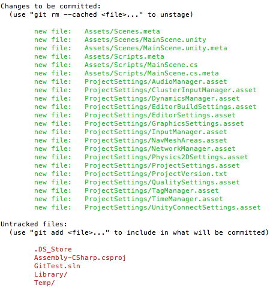

# 01 - Git Version Control

<a href="https://en.wikipedia.org/wiki/Version_control">Version control</a> is something that I’m sure most are familiar with (if not check out <a href="https://try.github.io/levels/1/challenges/1">this tutorial</a> and <a href="https://www.codecademy.com/learn/learn-git">this course</a>), but something that you may not be familiar with is how to optimize a Unity Project for Git version control.

One issue is that within a Unity Project there are many folders and files that can remain local and don’t need to be tracked. The Library folder, for instance, when not present is always constructed on load, while OS (Mac/Windows etc.) specific files don’t need to be synced across computers.

Firstly, in <b>Project Settings/Editor</b> insure <i>Version Control Mode</i> is set to <i>Visible Meta Files</i>


as this is required for version control. The benefit of this meta files is that unique settings for a file (such as import settings for a sprite etc.) are saved to an associated meta file, so syncing is easier and faster between projects.

Now we could commit only the relevant files (that is, the <i>Assets</i> and <i>ProjectSettings</i> folders)
```
git add Assets
git add ProjectSettings
```
but one issue is the annoyance of untracked files messages for files which we have no interest in tracking.



Luckily by writing a custom <a href="https://gist.github.com/defuncart/3cb2946c591df61e9bf1c280d0611674"><b>.gitignore</b></a> file (saved to the root project folder), we can specific the files that git should ignore tracking.</p>

```
# Unity generated folders
Temp/
Library/

# Custom Build Folder
Builds/

# MonoDevelop generated files
obj/
*.csproj
*.unityproj
*.sln
*.userprefs

# OS generated files
.DS_Store
.DS_Store?
._*
.Spotlight-V100
.Trashes
ehthumbs.db
Thumbs.db
```


One last point is the <i>Editor</i> setting <b>Asset Serialization Mode</b> to being <i>Force Text</i> or <i>Mixed</i> (between Text and Binary). Most Unity Projects will have scenes, prefabs and thus a lot of binary files. Force Text works better for version control in viewing the changes between commits, but Mixed means that binary files are imported faster into the project.