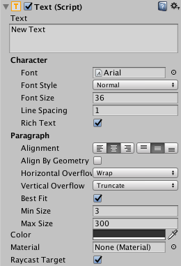
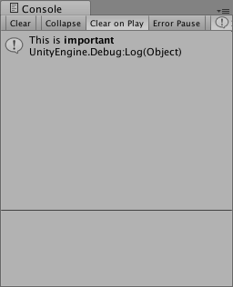
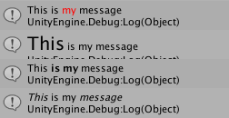

# 03 - Rich Text

You are probably familiar with the UI Text component in which text can be added to a UI canvas.



What is not so apparent is that this component supports rich text.

Thus using markup tags like  ``` <b>, <i>, <size> and <color> ``` , a single string can contain multiple font styles.

```
Text text;
text.text = "<size=100>This</size> is <color=green>green</color>, 
<size=50>and</size> this is <color=#FF0000>red</color>. <b>bold</b>, <i>italic</i>";
```


Even *Debug.Log* supports these markup tags which can be useful when reporting warnings and errors.



For more information see the [Unity documentation](https://docs.unity3d.com/Manual/StyledText.html).

It is, however, inconvenient and unnecessary to continually type these tags. Some Extension Methods would make everything easier now wouldn’t they?!

```C#
public static string SetColor(this string value, RichTextColor color)
{
  return string.Format("<color={0}>{1}</color>", color.ToString(), value);
}
```

where **RichTextColor** is a public enum of rich text tags

```C#
public enum RichTextColor
{
  aqua, black, blue, ...
}
```

which can then be used as

```C#
Debug.Log( "This is my message".SetColor(RichTextColor.red).SetBold() );
```

The instantiation of two new string objects just to set the color and bold isn't efficient but then again it is also only used during debug mode. A better approach would be somthing like *SetColorAndBold* which concatenates the tags. 

Take a look at *StringExtentions.cs* for more functionality. *SetColorForWords* is particularly useful if one wants to highlight one or more words.

```C#
Debug.Log( "This is my message".SetColorForWords(RichTextColor.red, 2) );
Debug.Log( "This is my message".SetSizeForWords(20, 0) );
Debug.Log( "This is my message".SetBoldForWords(1, 2) );
Debug.Log( "This is my message".SetItalicsForWords(0, 3) );
```

